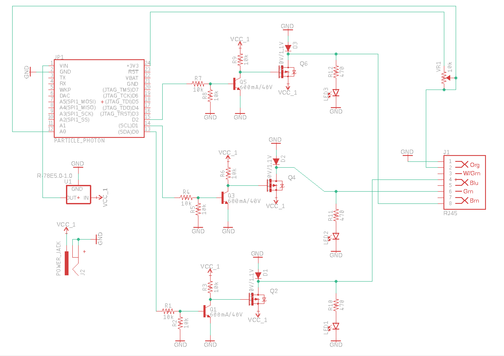
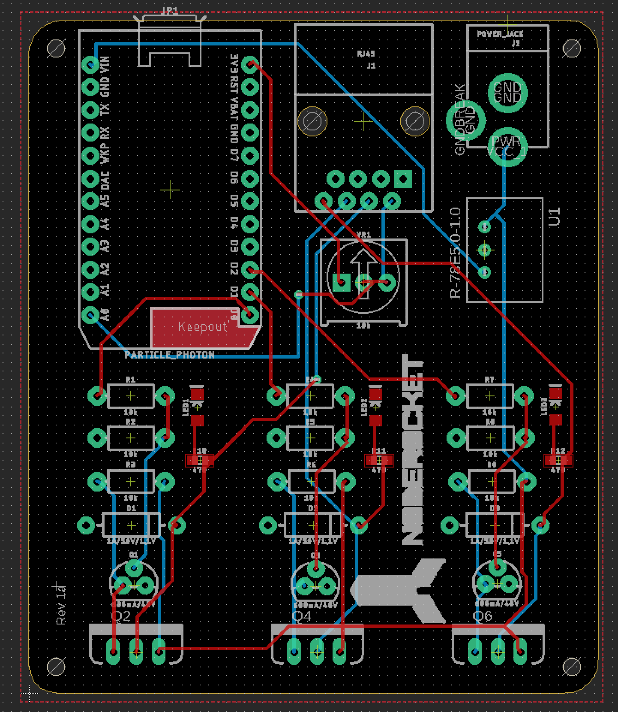

The circuit board for the launcher is comprised of a [particle photon](particle.md) chip which is wireless capable and has a set of GPIO pins. 

Of those GPIO pins, 3 are used to control the launch by sending a signal to three electromagnetic valves. The three valves control air into the rocket and finally the launch itself is controlled with a pneumatic cylinder which powers the release mechanism which sends the rocket into the air.

Take a look at the schematic of the launch circuit below. 

 

There are three separate switching circuits connected to D0, D1 and D2 of the photon. 

Why do we not just connect the electromagnetic valves directly to the photon?

There are a couple of reasons.

First, the valves require 12 volts, the GPIO pins only source 3.3 volts. 

Second, electromagnetic valves take more current than the photon can supply. even if the valves could operate at 3.3V, the amount of current could damage the photon, or any GPIO device. So it is important to isolate the supply current of external devices by using a switching transistor. In this design there is an NPN transistor switching a higher voltage MOSFET transistor. The MOSFET can handle more power 

Below is a view of the schematic layed out as a printed circuit board. This is the same board you will be working with.

 
 