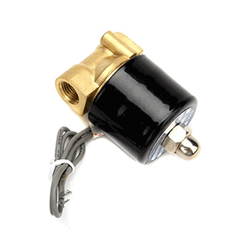
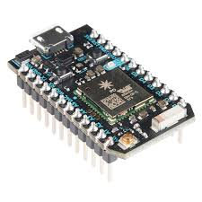
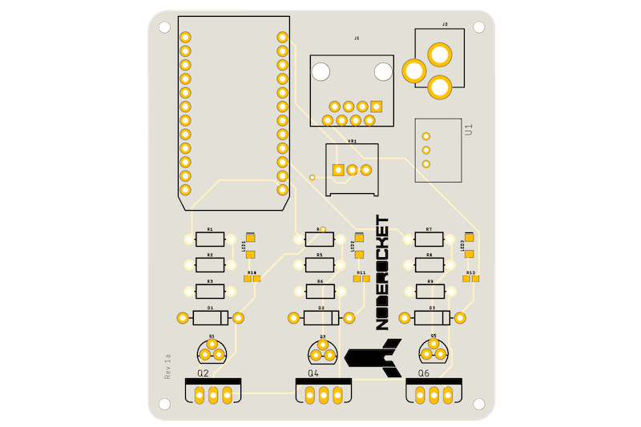
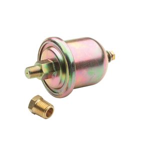

## Overview

The NodeRocket launcher is a platform for launching water rockets.  The goal of the launch platform is to provide programtic control of filling the rocket with air and water and launching the rocket.  

The launcher is constructed using 3 valves to:

- Fill the rocket with water
- Pressurize the rocket with air
- Launch the rocket

We have created a custom circuit board that integrates with a [Particle Photon](https://docs.particle.io/datasheets/photon-(wifi)/photon-datasheet) to control each of the valves.

Each of the valves is controlled by writing to a digital logic pin on the Photon. By writing `HIGH/LOW` to the pins you can switch the valves `ON` and `OFF`. 

- `D0` - Air valve
- `D1` - Water valve
- `D2` - Launch

The platorm also utilizes an oil pressure sensor to calculate the pressure (PSI) that the rocket is pressurized to.  The PSI can be calculated by using the value that is read from the analog pin `A0`.  See [Calculating PSI of rocket](psi.md) for more information.

### Resources:

- [US Water Rockets](http://www.uswaterrockets.com/)
- [Particle IO](http://particle.io)